# 🎮 OpenGL Demo

Ce projet est un démonstrateur OpenGL qui permet de charger visualiser des modèles 3D au format .obj avec différents modes d'éclairage et options de rendu.

## 📋 Prérequis

- CMake (version 3.8.2 minimum)
- Un compilateur C++ supportant C++17
- OpenGL 3.3 minimum
- Une carte graphique compatible avec OpenGL 3.3

## 🛠️ Compilation

1. Clonez le dépôt :

```bash
git clone https://github.com/RobinHil/opengl-demo.git
```

2. Créez un dossier de build et configurez le projet :

```bash
mkdir build
cd build
cmake ../opengl-demo
```

3. Compilez le projet :

```bash
make
```

## 🚀 Utilisation

Lancez l'application depuis le dossier build :
```bash
./project/project
```

### 🎯 Contrôles de la caméra

- **Clic gauche + déplacement** : Orbite autour de l'objet
- **Clic droit + déplacement** : Translation latérale et verticale
- **Molette** : Ajuste le champ de vision

### 🔧 Interface utilisateur

L'interface se trouve sur le panneau de droite et permet de contrôler :

- La couleur de fond
- L'affichage de la grille
- Les paramètres d'éclairage :
  - Mode d'éclairage (Aucun, Phong, Blinn-Phong, Gaussian)
  - Position de la lumière
  - Couleur de la lumière
  - Force ambiante
  - Force spéculaire
  - Brillance
- Les paramètres de l'objet :
  - Choix du modèle 3D
  - Affichage en fil de fer
  - Couleur de l'objet
  - Affichage des normales

### 💡 Modes d'éclairage

- **Aucun** : Rendu basique sans éclairage
- **Phong** : Éclairage calculé par pixel avec réflexion spéculaire
- **Blinn-Phong** : Variation de Phong avec un calcul optimisé de la spécularité
- **Gaussian** : Distribution gaussienne pour la réflexion spéculaire

## 📸 Captures d'écran

| Screenshot | Description |
| --- | --- |
| 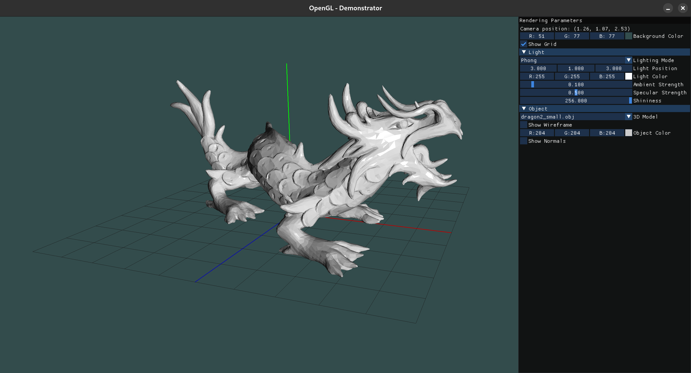 | *Illumination de Phong avec la grille de position* |
| 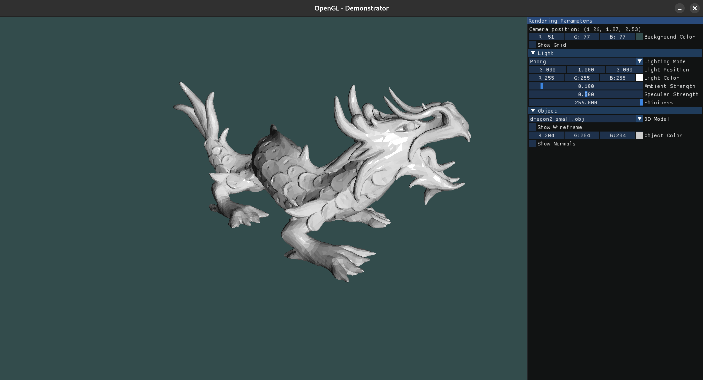 | *Illumination de Phong sans la grille de position* |
| 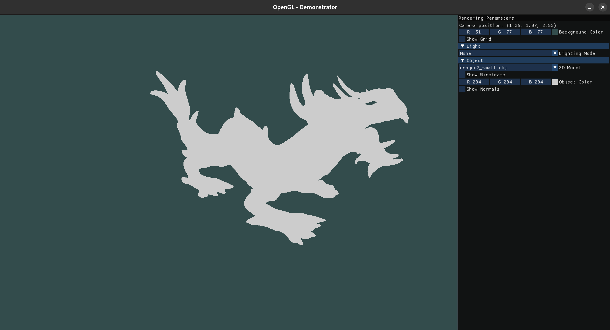 | *Aucun modèle d'illumination* |
| 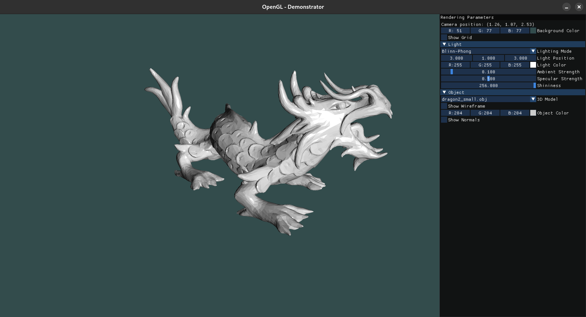 | *Illumination de Blinn-Phong* |
|  | *Illumination de Gausse* |
| 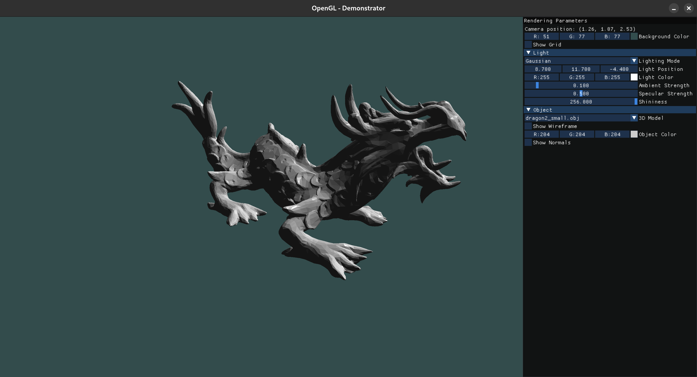 | *Modification de la position de la lumière* |
| 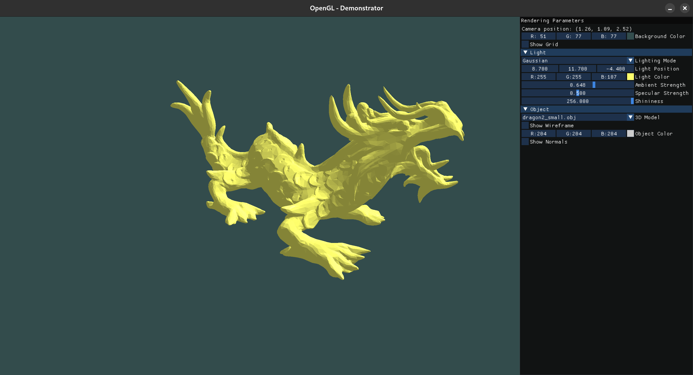 | *Modification de la couleur de la lumière* |
| 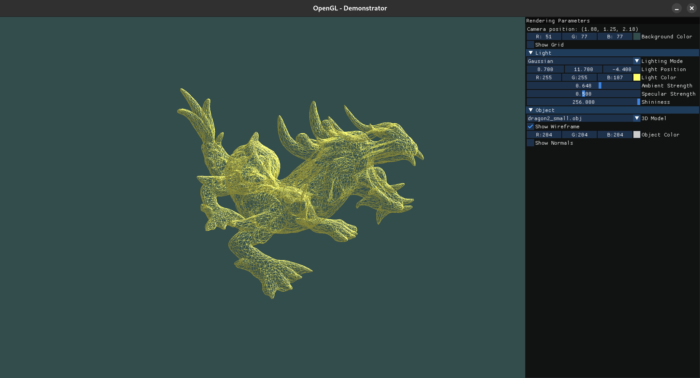 | *Affichage du maillage de l'objet* |
| 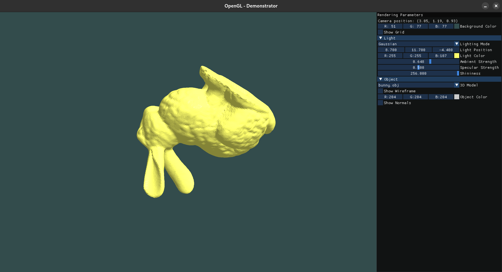 | *Chargement d'un objet 3D différent* |
| 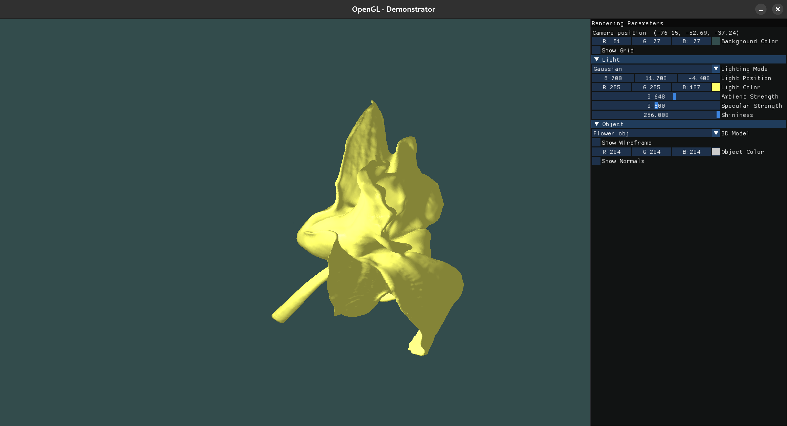 | *Chargement d'un objet 3D avec coordonnées de textures* |
| 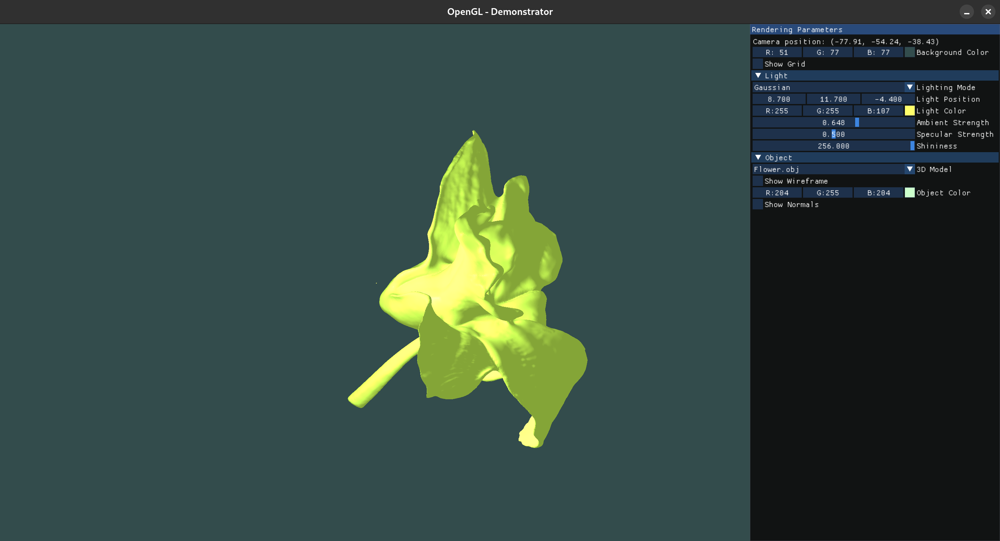 | *Modification de la couleur de l'objet* |
| 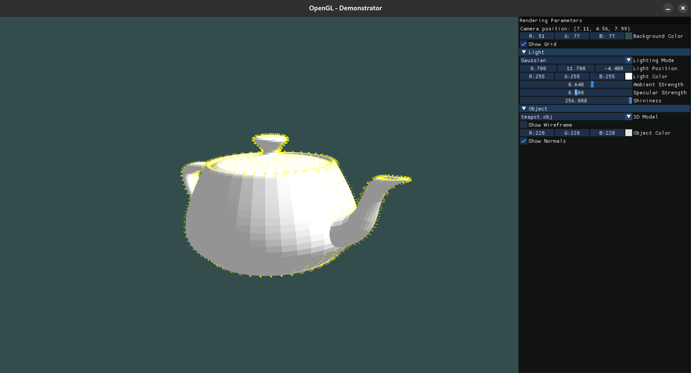 | *Affichage des normales de l'objet* |
| 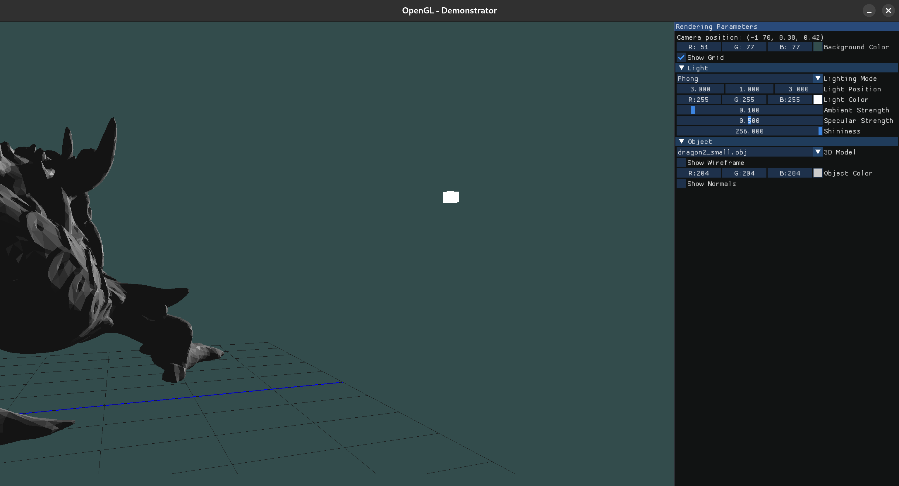 | *Objectification de la source de lumière* |
